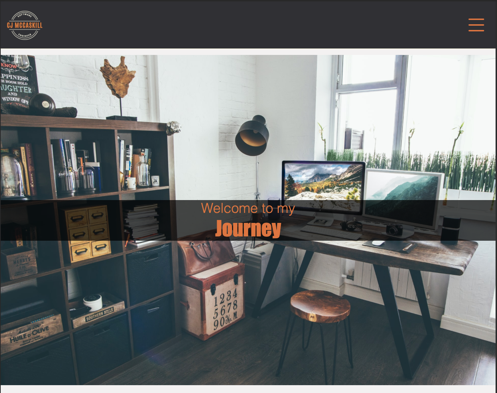
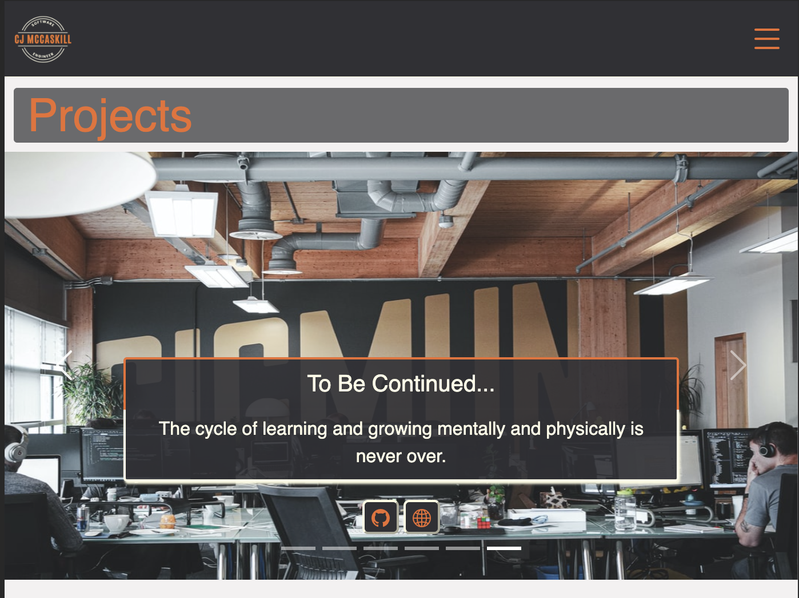

# Project Overview




## Project Schedule

| Day   | Deliverable                                  | Status   |
| ----- | -------------------------------------------- | -------- |
| Day 1 | Project Description                          | Complete |
| Day 1 | Wireframes / Priority Matrix / Timeline      | Complete |
| Day 2 | Core Application Structure (HTML, CSS, etc.) | Complete |
| Day 2 | MVP & Bug Fixes                              | Complete |
| Day 3 | Final Touches                                | Complete |
| Day 4 | Present                                      | Complete |

## Project Description

I built this site to showcase projects that I have worked on and possibly any projects that are a work in progress. That way, anyone following my journey can see what I have built and follow along on any projects that I am currently building. In the future, I will be adding a blog section to post info about what and where I am on my journey and any exciting topics or products that I find that makes life easier or I find to be really interesting.

## Portfolio I want to Emulate

| Link To Site                                                                                                                                                      | One Thing I'd Like To Incorporate                        |
| ----------------------------------------------------------------------------------------------------------------------------------------------------------------- | -------------------------------------------------------- |
| [behance.net](https://www.behance.net/gallery/113435205/Interior-Designer-Portfolio-UIUX-Design?tracking_source=search_projects_recommended%7Cportfolio%20design) | hero & design styling                                    |
| [sakshamkapoor.me](https://sakshamkapoor.me/)                                                                                                                     | animation in each section                                |
| [alexalhamdan.com](https://alexalhamdan.com/)                                                                                                                     | layout of the projects (wheel like carousel) & animation |

---

## Wireframes

- [Mobile](https://res.cloudinary.com/mccaskillmediagroup/image/upload/v1625866679/mobile_wireframe_portfolio.heic)
- [Desktop](https://res.cloudinary.com/mccaskillmediagroup/image/upload/v1625866713/desktop_wireframe_portfolio.heic)

<!-- ## Time/Priority Matrix

[Link](https://res.cloudinary.com/jkeohan/image/upload/a_270/v1591621734/project1_matrix_ocy5gc_h1kg0m.jpg)
Include a full list of features that have been prioritized based on the `Time and Priority` Matix. This involves drawing a a square. In the middle of the square, on the x axis draw a line. The most left part of the line should start with 0hrs and the end of the line should include 2hrs. This line will be used to estimate how much time any one feature will take to complete.
Now draw a vertical line on the y axis. The top of this line should have `High` and the bottom `Low`. This line will be used to assign a priority to to each feature you wish to include in the project.
Now create a separate list starting with A and assign it one of the features. Continue to assign each feature a letter. Once complete add each letter to the matrix assigning based on what your feel it's prioirty is an how long it will take to implement. If any one feature takes longer than 2hrs to complete than break it down into smaller tasks and reassign them a new letter.
Once complete tally up the time and determine how long the project will take to complete. Now break those features into MVP and PostMVP so you can guarantee you will have a fully functioning project to demo. -->

### MVP/PostMVP - 5min

The functionality will then be divided into two separate lists: MPV and PostMVP. Carefully decided what is placed into your MVP as the client will expect this functionality to be implemented upon project completion.

#### MVP (examples)

- Pull data using google json api
- Render data on page
- Implement a project carousel

#### PostMVP

- Add focus/animation on the center project to grow in size by 2-5% depending on viewport size.
- Animate the logo on the page on initial loading of the page
- Put an animated arrow signaling the user to scroll down

## Functional Components

Based on the initial logic defined in the previous sections try and breakdown the logic further into functional components, and by that we mean functions. Try and capture what logic would need to be defined if the game was broken down into the following categories.
Time frames are also key in the development cycle. You have limited time to code all phases of the game. Your estimates can then be used to evalute game possibilities based on time needed and the actual time you have before game must be submitted. It's always best to pad the time by a few hours so that you account for the unknown so add and additional hour or two to each component to play it safe.

#### MVP

| Component                  | Priority | Estimated Time | Actual Time |
| -------------------------- | :------: | :------------: | :---------: |
| Navbar                     |    H     |      1hr       |   1.5hrs    |
| HTML Structure             |    H     |      3hrs      |    3hrs     |
| About me                   |    H     |      1hr       |     1hr     |
| Project cards              |    H     |      2hrs      |    2hrs     |
| Project section layout     |    H     |      3hrs      |    3hrs     |
| Contact form               |    M     |     1.5hrs     |     1hr     |
| Responsive                 |    H     |      3hrs      |    3hrs     |
| CSS styling - colors/fonts |    L     |      1hr       |     1hr     |
| CSS styling - Hero         |    M     |     1.5hrs     |    2hrs     |
| CSS styling - About me     |    M     |      1hr       |   1.5hrs    |
| CSS styling - Projects     |    M     |      3hrs      |    3hrs     |
| Social Media Icons         |    L     |      1hr       |     1hr     |
| Total                      |    H     |     22hrs      |    23hrs    |

#### PostMVP

| Component                       | Priority | Estimated Time | Actual Time |
| ------------------------------- | :------: | :------------: | :---------: |
| Link buttons on Desktop         |    L     |      1hr       |     1hr     |
| Navbar -pin'd top on scroll     |    L     |      1hr       |    .5hr     |
| Projects carousel on M/D        |    M     |      3hr       |   3.5hrs    |
| Navbar image                    |    L     |      1hr       |     1hr     |
| Project card hover/focus center |    L     |      2hr       |     N/A     |
| Animate the nav arrow down      |    L     |      1hr       |     N/A     |
| Total                           |    L     |      9hrs      |    5hrs     |

## Additional Libraries

- normalize.css package
- jQuery
- Bootstrap 5

## Code Snippet

This was of my biggest hurdles in the whole project was figuring out how to implement a carousel. But with a little grit and determination I was able to achieve the outcome that I was wanting.

```
$.ajax("./json/projects.json")
  // when the data arrives, do something with it
  .then((data) => {
    // loop over the array of the projects
    data.forEach((project, index) => {
      const $div = $("<div>")
        .attr("class", `carousel-item ${index == 0 ? "active" : ""}`)
        .attr("data-bs-interval", 8000);
	}
  }
```

## Issues and Resolutions

I had a hard time figuring out how to structure my jQuery call from my json file to my html. I had read through and tried .slide, .skippr, and various other plugins to help with building out my carousel adn none of them really worked the way I wanted them to. So

#### SAMPLE.....

**ERROR**: Was applying to all of my cards instead of just first element.

```
<div class="carousel-item active" data-bs-interval="8000">
```

**RESOLUTION**: In my jQuery call I had to add the attribute psuedocode to create the elements correctly.

```
data.forEach((project, index) => { const $div = $("<div>") .attr("class",`carousel-item ${index == 0 ? "active" : ""}`) .attr("data-bs-interval", 8000);}
```
